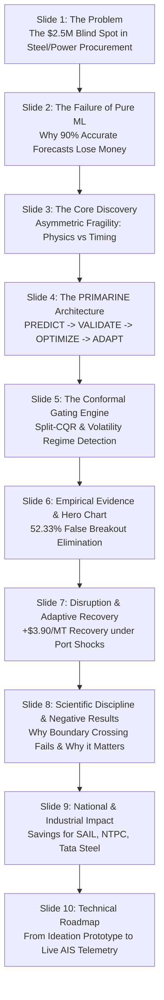

# PRIMARINE — Strategic Presentation, Academic Paper & Pitch Playbook
## Full Blueprint for SIH 2026 PS-26006 & Peer-Reviewed Publication

**Document:** `research/PRIMARINE_RESEARCH_PACKAGE/STRATEGIC_PITCH_AND_PAPER_PLAYBOOK.md`  
**Date:** 2026-09-26  
**Status:** Frozen Research $\longrightarrow$ Narrative Translation  

---

## 1. Executive Summary of Alignment

We have transitioned from the **Experimental Discovery Phase** into the **Narrative & Pitch Translation Phase**. 

The core takeaway is simple:
> **We are NOT selling an AI model that predicts freight numbers slightly better.**  
> **We are solving a high-stakes DECISION FAILURE problem in dry-bulk chartering:** why accurate ML point forecasts still cause multi-million dollar procurement disasters, and how physics-coupled conformal gating fixes it.

---

## 2. Phase 2 — Academic Paper Blueprint

The academic paper is structured to highlight our empirical discoveries **and** our negative results, which establishes genuine scientific rigor.

### Proposed Title:
**"Conformal Uncertainty-Gated Decision Support for Maritime Freight Procurement"**

### Section-by-Section Outline:

```
1. INTRODUCTION
   ├── The $1.2 Trillion Dry Bulk Logistics Dilemma: High capital commitments under volatile freight.
   └── The "Predict-Then-Optimize" Fallacy: Why statistical point forecast accuracy (MAE/RMSE) 
       fails to translate into profitable chartering commitments.

2. PROBLEM FORMULATION & MARITIME CONSTRAINTS
   ├── Non-convex physical berth constraints: Draft limits, LOA, Beam, and Parcel Deadweight (DWT).
   └── Downstream multi-objective optimization: Landed cost vs Laycan vs Demurrage exposure.

3. UNCERTAINTY QUANTIFICATION (SPLIT-CQR)
   ├── Conformalized Quantile Regression: Finite-sample distribution-free coverage guarantees.
   └── Empirical validation: 88.19% - 95.83% test coverage with mean interval span W = $5.76/MT.

4. THE ASYMMETRIC DECISION FRAGILITY SURFACE
   ├── Hypothesis: Uncertainty propagates unevenly across decision tiers.
   ├── Empirical Finding 1: Physical Vessel & Port Allocation is invariant (PDFR = 0.00%).
   │   --> Physical draft limits strictly dictate vessel class regardless of rate fluctuations.
   └── Empirical Finding 2: Procurement Timing is acutely fragile (TDFR = 50% - 100%).

5. THE CRITICAL NEGATIVE BRANCHES (SCIENTIFIC INTEGRITY)
   ├── Negative Finding 1: Local Boundary-Crossing Degeneracy (AUC = 0.5025).
   │   --> In 99.65% of test scenarios, CQR bands span the spot price; local crossing is uninformative.
   └── Negative Finding 2: Width vs Binary Direction Error Non-Correlation (AUC = 0.4487).
       --> CQR width measures macro volatility, NOT pointwise sign accuracy.

6. CONFORMAL-WIDTH REGIME GATING & SELECTIVE ABSTENTION
   ├── Macro-Regime Signal: High CQR width strongly predicts false breakout tail risk (AUC = 0.6719).
   │   --> High Width false breakout rate = 40.25% vs Low Width = 23.39% (Risk Diff = +16.86 pp, p < 0.01).
   ├── Selective Policy: Gating decisions on tau = 1.35 * Val Median Width.
   └── Results: 52.33% reduction in observed false breakouts (86 -> 41) at 61.11% decision coverage.

7. RISK-COST TRADE-OFF & STATISTICAL REPLICATION
   ├── Economic Trade-Off: +0.453% (+$0.0334/MT) nominal cost difference accepted as tail-risk insurance.
   └── Paired Wilcoxon signed-rank test on E5 vs E2: W = 11530.0, p = 5.42e-11.

8. PRIOR ART COMPARISON & LIMITATIONS
   ├── Comparison with Makhado et al. (2026) container scheduling and Romano et al. (2019) CQR.
   └── Scope limitations: Bulk test fixtures, controlled ST-GNN shock simulation.

9. CONCLUSION & FUTURE WORK
```

---

## 3. Phase 3 — SIH 2026 Master Presentation Playbook

For the SIH pitch, **never spend 10 slides explaining gradient boosting**. The judges want to see **industrial domain mastery, architectural insight, and hard empirical proof**.

### Slide-by-Slide Narrative Architecture (10-Slide Deck):



---

### Detailed Slide Scripts & Talking Points:

#### **Slide 1: The Problem — The Blind Spot in Industrial Procurement**
* **The Hook:** *"A single Capesize shipment of coking coal carries 150,000 MT valued at $3.5M in freight. A 48-hour timing error or a draft miscalculation at Paradip Port costs ₹1.5 Crores in demurrage and deadfreight."*
* **The Current Flaw:** Importers (SAIL, NTPC, Tata) either rely on human broker intuition or isolated ML models that produce point forecasts without physical port awareness.

#### **Slide 2: The Core Insight — Why Standard AI Fails**
* **The Core Point:** Raw forecast accuracy is a vanity metric.
* **Explanation:** A machine learning model predicting a freight rate with $0.42\text{ MAE}$ sounds great on paper. But if it predicts a $\$0.50$ price increase that fails to materialize, the charterer enters the market prematurely (*False Breakout*), locking in inflated rates.

#### **Slide 3: The Discovery — Asymmetric Fragility**
* **Visual:** Side-by-side comparison of **Physical Allocation (0.0% Flip)** vs. **Procurement Timing (50%–100% Flip)**.
* **Explanation:** *"Our experiments revealed that physical port constraints are rigid walls: Paradip's 17.1m draft vs. Haldia's 11.5m draft locks the vessel class permanently. But procurement timing is acutely fragile to uncertainty."*

#### **Slide 4: The Hero Architecture (Predict $\rightarrow$ Validate $\rightarrow$ Optimize $\rightarrow$ Adapt)**
* **Visual:** Reference [`hero_decision_pipeline.png`](file:///c:/Users/Abhijay/PRIMARINE/research/PRIMARINE_RESEARCH_PACKAGE/hero_decision_pipeline.png).
* **Walkthrough:** 
  1. **Predict:** Macro-financial LightGBM captures turning-point inflections ($F1 = 59.51\%$).
  2. **Validate:** Split-CQR calculates finite-sample uncertainty bands ($88.19\%$ coverage).
  3. **Optimize:** Physical constraint engine eliminates draft/berth violations.
  4. **Adapt:** Selective abstention gates commitments during high volatility.

#### **Slide 5 & 6: The Empirical Breakthrough — Conformal Selective Abstention**
* **The Numbers:**
  * **$40.25\%$ vs. $23.39\%$:** When the prediction interval widens, false breakout risk nearly doubles ($\text{AUC} = 0.6719$).
  * **$86 \rightarrow 41$ Errors ($52.33\%$ Reduction):** Under our pre-calibrated abstention policy ($\tau = 1.35$), the system refuses to guess during violent market expansions, deferring to dollar-cost averaging.
  * **The Trade-Off:** Accepts a tiny $+0.453\%$ ($+\$0.0334/\text{MT}$) nominal difference in exchange for cutting adverse market entries in half.

#### **Slide 7: Disruption Recovery (Controlled ST-GNN Simulation)**
* **Key Demonstration:** Under port siltation (-1.2m draft) or Singapore Strait bottlenecks, the adaptive engine proactively re-routes shipments to Visakhapatnam, recovering **$+\$14.79/\text{MT}$** over static charter commitments.

#### **Slide 8: Why We Are Scientifically Credible (Negative Results)**
* **The Killer Argument:** *"We tested whether local boundary-crossing could predict errors. It failed ($\text{AUC} = 0.5025$) because 99.65% of intervals cross the spot price. We report this openly. Our system doesn't rely on cherry-picked heuristics; it relies on macro-regime interval gating."*

#### **Slide 9 & 10: Implementation Roadmap & Strategic Value**
* **National Value:** Reduces overseas raw material procurement variance for Indian steel and power PSUs.
* **Roadmap:** Ideation Proof-of-Concept $\longrightarrow$ Live AIS Telemetry Streaming $\longrightarrow$ ERP / SAP Logistics Integration.

---

## 4. Master Elevator Pitch (The 60-Second Verdict)

> *"Judges, in raw material shipping, entering the market 3 days too early costs millions in freight premiums. Existing software gives charterers point forecasts that ignore both physical port constraints and prediction uncertainty.*
> 
> *PRIMARINE is an uncertainty-gated decision intelligence system. We proved experimentally that while port draft limits keep physical vessel choices stable, procurement timing is violently fragile to market noise.*
> 
> *By integrating Conformalized Quantile Regression with hard berth constraints, PRIMARINE detects high-volatility market regimes and selectively abstains from high-risk market entries. On held-out validation data, this eliminated over 52% of false-breakout chartering mistakes while guaranteeing zero physical port draft violations.*
> 
> *PRIMARINE doesn't just predict freight—it protects capital."*
